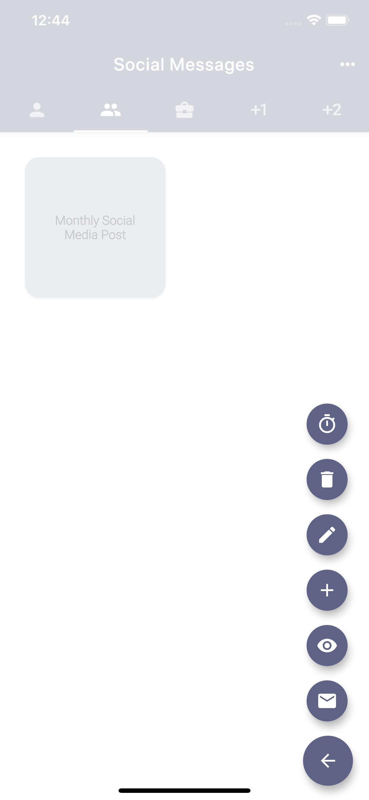
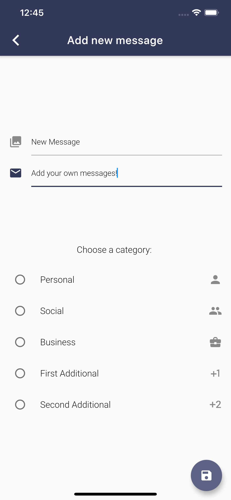

# 📨 _Reply ("Reply" rebuilt with Flutter!) 🐦

-------
Easily send your own custom, pre-defined messages through any platform
* ✅ Create and store your own message templates 
* ✅ Easily send your messages through any platform
* ✅ Add, edit, and delete your messages
* ✅ Preview and edit your message before you send it
* ✅ Set a timer to remind you to respond with one of your messages at a later time

## 🚀 Motivation
I wanted to translate a native Android app I built to Flutter to practice building a Flutter application, allow my friends on iOS to download my app, and see the differences between the two platforms.

## 🕹 Features
- Solves the problem of repeatedly typing commonly sent messages and not being able to send them through multiple platforms
- Uses Material Design components for a beautiful, consistent design

## 🖥 Technologies used

<b>Built with</b>
- Flutter SDK
- Dart
- [Firebase Authentication](https://firebase.google.com/docs/auth)
- [Cloud Firestore](https://firebase.google.com/products/firestore)
- [Material Design](https://material.io/)

## 📚 Libraries used

* [cloud_firestore](https://pub.dev/packages/cloud_firestore)
* [firebase_auth](https://pub.dev/packages/firebase_auth)
* [firebase_core](https://pub.dev/packages/firebase_core)
* [google_sign_in](https://pub.dev/packages/google_sign_in)
* [flutter_speed_dial](https://pub.dev/packages/flutter_speed_dial)
* [share](https://pub.dev/packages/share)
* [material_about](https://pub.dev/packages/material_about)  
* [url_launcher](https://pub.dev/packages/url_launcher)
* [flutter_local_notifications](https://pub.dev/packages/flutter_local_notifications)
* [rxdart](https://pub.dev/packages/rxdart)
* (apple_sign_in)[https://pub.dev/packages/apple_sign_in]
* [flutter_secure_storage](https://pub.dev/packages/flutter_secure_storage)

## 👨🏻‍💻 Developed By
[Ashton Jones](https://www.ashtonjones.dev/) 

👨‍💻 Google Certified Android Engineer |
✍ Writer |
🧘‍♂️ Stoic && Meditator
👨🏻‍💻 Ashton Jones
📩 ashtonjonesdev@gmail.com
🌐 www.ashtonjones.dev

Copyright 2020 Ashton Jones

## 📸 Screenshots
&ensp;&ensp;&ensp;
------
&ensp;&ensp;&ensp;
------
&ensp;&ensp;
&ensp;

